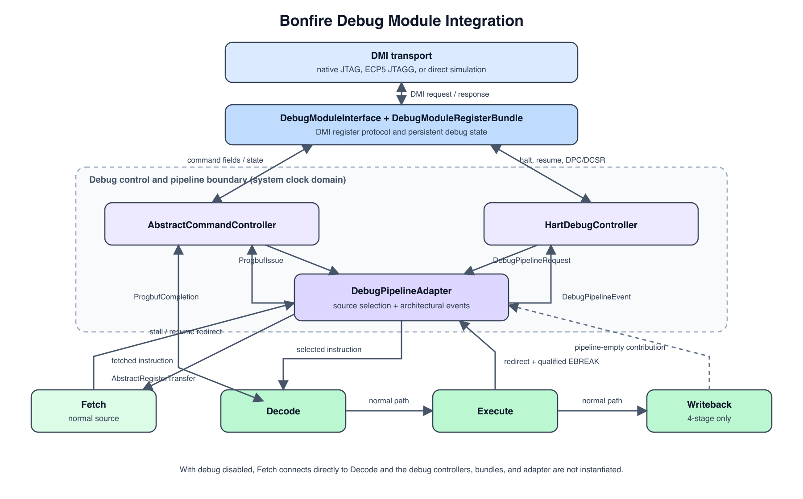

# Bonfire Core Debug Stack (Technical README)

This document describes the current debug stack in **bonfire-core**:

- DMI-visible Debug Module registers and protocol handling (`rtl/debug/dm_registers.py`, `rtl/debug/dmi.py`)
- Abstract-command, hart-state, and pipeline integration logic (`rtl/debug/abstract_command.py`, `rtl/debug/hart_debug.py`, `rtl/debug/pipeline_adapter.py`)
- Native JTAG Debug Transport Module (`rtl/debug/jtag_dtm.py`)
- Shared DTM transport logic (`rtl/debug/dtm_transport.py`)
- ECP5 JTAGG frontend (`rtl/debug/ecp5_jtagg_client.py`)
- OpenOCD remote_bitbang simulation server (`openocd_bitbang`)
- Optional integration of the debug path into the Bonfire core (`rtl/bonfire_core_top.py` and the selected pipeline backend)

---

## Debug Access Paths

All supported debug frontends converge at the DMI boundary. The external or
simulation-specific portions are:

- Native JTAG simulation: `GDB -> OpenOCD -> remote_bitbang TCP -> native JTAG TAP/DTM -> DMI`
- ECP5 JTAGG simulation: `GDB -> OpenOCD -> remote_bitbang TCP -> emulated ECP5 TAP -> JTAGG frontend -> DMI`
- Direct simulation server: `GDB -> Simulation GDB Server -> DMI`
- ECP5 hardware: `GDB -> OpenOCD -> FTDI adapter -> ECP5 FPGA TAP/JTAGG -> JTAGG frontend -> DMI`

The supported Ice Pi Zero and ULX3S configurations use their FTDI FT231XQ
interface through OpenOCD's `ft232r` adapter driver. Direct module tests can
also drive DMI without GDB or JTAG.

From DMI onward, every frontend uses the same internal path:

`DMI -> DebugModuleInterface -> DebugModuleRegisterBundle -> debug controllers -> DebugPipelineAdapter -> pipeline`

---

## 1. Architecture Overview

The implementation targets **RISC-V Debug Spec 0.13** semantics in a pragmatic subset (single-hart focus, abstract command driven debug flow).

The implementation separates four concerns:

1. The JTAG/DTM frontend transports DMI requests and responses.
2. `DebugModuleInterface` implements the DMI register protocol and stores requests and command fields in `DebugModuleRegisterBundle`.
3. `AbstractCommandController` and `HartDebugController` own abstract-command sequencing and architectural hart debug state respectively.
4. `DebugPipelineAdapter` is the boundary between debug control and the normal Fetch/Decode/Execute pipeline.

Normal Fetch and the Program Buffer are independent instruction sources. When debug support is enabled, `DebugPipelineAdapter` selects between them immediately before Decode. The downstream Decode and Execute stages use the same functional paths for either source.



---

## 2. Debug Module Registers and Controllers

### 2.1 Main responsibilities

- Expose DMI-visible debug registers (`dmstatus`, `dmcontrol`, `hartinfo`, `abstractcs`, `abstractauto`, `command`, `dataN`, `progbufN`)
- Track hart state (`running` / `halted`)
- Accept halt/resume requests
- Launch and track abstract commands
- Provide command result and error signaling (`cmderr`)
- Store debug-visible control/state (e.g. `dpc`, `dcsr` fields)

### 2.2 Implemented register-level behavior

- **`dmstatus` (0x11):** reports running/halted, resumeack, authenticated, spec version, impbreak
- **`dmcontrol` (0x10):** handles halt request, resume request, ndmreset bit storage
- **`hartinfo` (0x12):** reports datacount and dscratch count from config
- **`abstractcs` (0x16):** reports `progbufsize`, `busy`, `cmderr`, `datacount`; supports write-1-to-clear for `cmderr`
- **`command` (0x17):** accepts access-register command type (subset)
- **`abstractauto` (0x18):** supports autoexec triggers for `dataN` and `progbufN`
- **`data0..dataN` (0x04+):** command input/output data registers
- **`progbuf0..1` (0x20/0x21):** up to 2 program buffer words (config dependent)

### 2.3 Abstract command support

Implemented command type:

- **Access Register** (`cmdtype=0`) subset

Supported behavior:

- 32-bit transfers (`aarsize=2`)
- GPR read/write via abstract command path
- Limited CSR access path for debug CSRs (`dpc`, `dcsr` mapping used by current logic)
- Optional `postexec` to execute program buffer after transfer
- `transfer=0` + `postexec=1` style execution flow

Program buffer execution:

- `progbuf_size` supports **1 or 2** entries
- Execution state machine uses `exec` / `exec2` / `wait_retire`
- Two-slot execution runs `progbuf1` after `progbuf0` unless `ebreak` stops sequencing

Autoexec support:

- `autoexecdataN` and `autoexecprogbufN` are implemented
- Used for repeated operations such as memory streaming through `data0`

### 2.4 Core interaction behavior

- A halt request stops acceptance of new normal Fetch instructions while allowing an already accepted instruction to complete.
- The hart enters halted state after the pipeline becomes empty and stores the next architectural PC in `dpc`.
- Resume redirects Fetch to the address stored in `dpc`.
- Single step accepts exactly one normal instruction, waits for architectural completion, and stores its resolved next PC in `dpc`.
- An Execute-qualified EBREAK with `dcsr.ebreakm` set enters Debug Mode at the EBREAK PC instead of taking the normal breakpoint trap.
- Program Buffer instructions enter the pipeline through the debug instruction source rather than through Decode-owned command orchestration.

### 2.5 Abstract command controller (`rtl/debug/abstract_command.py`)

`AbstractCommandController` owns the abstract-command execution lifecycle after a command has been accepted by the DMI register interface. Its responsibilities are:

- Run accepted access-register commands only while the hart reports halted state.
- Sequence GPR reads and writes through `AbstractRegisterTransferBundle`.
- Start optional post-execution after the register transfer.
- Issue `progbuf0` and, when configured, `progbuf1` one word at a time.
- Wait for each issued Program Buffer instruction to complete before issuing the next word.
- Treat the Program Buffer EBREAK instruction (`0x00100073`) as an end marker reported by the pipeline adapter.

GPR transfers deliberately reuse the existing register-file and pipeline write paths. A read selects the requested register on the Decode register-file port. A write is represented as a small internal ALU operation, so no separate register-file writeback mux is introduced.

### 2.6 Hart debug controller (`rtl/debug/hart_debug.py`)

`HartDebugController` is the single owner of the hart debug-mode state machine. Its internal states are:

- `running`: normal instruction acceptance is allowed.
- `halt_pending`: normal Fetch is stopped while accepted pipeline work drains.
- `halted`: the hart is stopped, but abstract commands and Program Buffer execution remain available.
- `step_issue`: one normal instruction may be accepted after a resume redirect.
- `step_wait`: no further normal instruction may be accepted while the stepped instruction completes.

The controller generates `hart_state`, halt/resume acknowledgement, resume redirects, and DPC/DCSR cause updates. Halt request, single-step completion, and Execute EBREAK therefore use explicit architectural pipeline events rather than reconstructing instruction validity from Decode, jump, kill, and Fetch state.

### 2.7 Pipeline adapter (`rtl/debug/pipeline_adapter.py`)

`DebugPipelineAdapter` provides the optional debug boundary in front of Decode:

- It selects normal Fetch or a Program Buffer word as the Decode input.
- Program Buffer issue has priority over Fetch while the hart is halted.
- It stalls Fetch while normal instruction acceptance is disabled, during a debug redirect, while Decode is busy, or while a Program Buffer word is being offered.
- It consumes the Program Buffer EBREAK end marker without forwarding it to Decode.
- For normal instructions, it records the sequential next PC and replaces it
  with an Execute redirect target for taken branches, jumps, traps, and
  returns.
- Program Buffer instructions reuse the stalled Fetch PC inputs. Their PC is
  not part of the debug interface and does not update the architectural next
  PC or `dpc`.
- It reports completion only after all pipeline stages relevant to the selected backend are empty.

Resume redirects are combined with normal Execute redirects at the backend output, with the debug resume target taking priority.

### 2.8 Controller interfaces

The controllers communicate through explicit bundles rather than by depending on Decode-internal debug state:

| Bundle | Producer -> Consumer | Purpose |
| --- | --- | --- |
| `AbstractRegisterTransferBundle` | `AbstractCommandController` -> Decode/register-file path, with read data returned to the controller | GPR register number, direction, write data, and read result for an abstract register transfer |
| `ProgbufIssueBundle` | `AbstractCommandController` -> `DebugPipelineAdapter` | Program Buffer word, valid indication, and last-word indication |
| `ProgbufCompletionBundle` | `DebugPipelineAdapter` -> `AbstractCommandController` | Reports that a word was accepted, completed, or consumed as the EBREAK terminator |
| `DebugPipelineRequestBundle` | `HartDebugController` -> `DebugPipelineAdapter` and backend | Controls normal Fetch acceptance, pipeline flush, and resume redirect address |
| `DebugPipelineEventBundle` | `DebugPipelineAdapter` -> `HartDebugController` | Reports normal-instruction acceptance and completion, resolved architectural next PC, pipeline-empty state, and qualified Execute EBREAK events |

---

## 3. Native JTAG DTM (`rtl/debug/jtag_dtm.py`)

### 3.1 Main responsibilities

- Implement the native RISC-V JTAG TAP state machine
- Expose fixed standard RISC-V debug JTAG instructions and DR behavior
- Translate DMI DR scans into transport transactions

### 3.2 Implemented JTAG instructions

- **IDCODE** (`0x01`)
- **DTMCS** (`0x10`)
- **DMI** (`0x11`)
- **BYPASS** (`0x1F`)

Key constants:

- IR width: 5
- IDCODE: `0x10E31913`
- DTM version: 1
- Fixed IR map: `IRLEN=5`, `IDCODE=0x01`, `DTMCS=0x10`, `DMI=0x11`, `BYPASS=0x1F`

### 3.3 Native clock-domain handling

- The native TAP state machine, IR/DR shifting, and DTM scan handling run
  directly in the external `TCK` clock domain. `TMS`, `TDI`, `TDO`, and
  `TRSTN` are handled there; they are not individually synchronized into the
  system clock domain.
- Completed scan requests are handed to `DmiCdcBridge`; only the DMI
  transaction crosses into the system clock domain.

---

## 4. Shared DTM transport logic (`rtl/debug/dtm_transport.py`)

This block contains `DmiCdcBridge`, the frontend-independent DMI
request/response clock-domain crossing shared by the native JTAG DTM and the
ECP5 JTAGG frontend. Scan registers remain in their respective frontend and
run in the frontend's `TCK` or `JTCK` domain.

Implemented behavior:

- Transfers a stable DMI payload containing `{address, data, op}` from the scan
  clock domain into the system clock domain using a synchronized request toggle
- Supports DMI operations after the crossing:
  - NOP
  - READ
  - WRITE
- Read pipeline behavior implemented via internal request/response staging
- Holds the response payload stable while a response toggle is synchronized
  back into the scan clock domain
- Transfers `dmireset` through a separately synchronized toggle
- `dmistat` currently kept at OK under normal operation

It intentionally does **not** contain:

- a TAP state machine
- IDCODE handling
- generic IR decode
- FPGA-vendor specific USER-instruction binding

---

## 5. ECP5 JTAGG frontend (`rtl/debug/ecp5_jtagg_client.py`)

### 5.1 Main responsibilities

- Bind the shared DTM transport logic to ECP5 `JTAGG`-style signals
- Map `ER1 -> DMIACCESS`
- Map `ER2 -> DTMCS`
- Keep FPGA USER-instruction binding outside the transport core

Implemented interface signals:

- `JTCK`, `JTDI`
- `JSHIFT`, `JUPDATE`, `JRSTN`
- `JCE1`, `JCE2`
- `JRT1`, `JRT2`
- `JTDO1`, `JTDO2`

Key constants:

- Outer TAP IR width: 8
- Default emulated ECP5 IDCODE: `0x41111043` (`LFE5U_25F`)
- `ER1 = 0x32`
- `ER2 = 0x38`

### 5.2 Clock-domain handling

The JTAGG scan/update logic runs directly in the ECP5 `JTCK` domain. As with
the native TAP, `DmiCdcBridge` transfers only complete DMI transactions and DTM
reset requests into the system clock domain and returns completed responses to
the `JTCK` domain.

### 5.3 Simulation support

For simulation and OpenOCD-facing tests, the repository also contains:

- `rtl/debug/ecp5_jtagg_tap.py`

This is a TAP emulator that presents IDCODE plus USER instruction selection on the external JTAG pins and drives the internal JTAGG-style signals. It is a simulation/test helper; real FPGA integration is expected to bind the frontend to the vendor `JTAGG` primitive instead.

---

## 6. OpenOCD remote_bitbang server (`openocd_bitbang`)

### 6.1 Components

- `remote_bitbang.py`: protocol server (OpenOCD remote_bitbang command handling)
- `sim_testbench.py`: full MyHDL simulation tying server + selected JTAG frontend + core + RAM
- `main.py`: CLI runner for hosting the simulation server
- `bonfire.cfg`: native JTAG example OpenOCD configuration
- `bonfire_ecp5_er.cfg`: ECP5 JTAGG example OpenOCD configuration

### 6.2 Implemented protocol support

Supported remote_bitbang commands:

- Pin writes (`'0'..'7'`) for `TCK/TMS/TDI`
- TDO read (`'R'`)
- Reset writes (`'r'..'u'`) for TRST handling
- LED/blink-related commands (`B/b/Z/z/O/o`) are accepted/ignored safely
- Client quit (`'Q'`) with optional simulation stop behavior

### 6.3 Runtime and observability features

CLI options include:

- `--host`, `--port`
- `--hex`, `--ramsize`
- `--verbose` (protocol logging)
- `--observe-jtag` (TAP + scan tracing)
- `--debug-trace` (DMI/progbuf/abstract-command trace)
- `--vcd`
- `--exit-on-client-quit`
- `--jtag-transport standard|ecp5_jtagg`

The debug trace monitor reports:

- DMI reads/writes
- Abstract command writes and state transitions
- Progbuf writes and execution
- Halt/resume transitions
- DBUS activity while halted

---

## 7. Debug Module Integration into the Core

### 7.1 Top-level integration

In `BonfireCoreTop`:

- `DebugModuleRegisterBundle` and `DebugModuleInterface` are created only when `config.enableDebugModule` is true.
- The core instance requires a `debugTransportBundle` in this mode.
- The DMI interface connects the selected transport frontend to the shared debug register bundle.
- Fetch itself has no dependency on the debug register bundle or hart debug state.

### 7.2 Pipeline integration

Both `SimpleBackend` and `PipelinedBackend` instantiate the same debug controllers and bundle interfaces when debug support is enabled. The backend supplies the pipeline-specific completion boundary:

- In the three-stage backend, the pipeline is empty when Decode is invalid and Execute is neither busy nor valid.
- In the four-stage backend, the same condition also requires the registered Writeback stage to be invalid.

The remaining integration points are intentionally narrow:

- `DebugPipelineAdapter` drives the Decode instruction, PC, and enable inputs and controls the Fetch stall input.
- Decode retains only the `AbstractRegisterTransferBundle` GPR access path.
- Execute reports qualified EBREAK events and accepts the debug flush request.
- Execute redirect and destination signals feed the adapter so completion events contain the resolved architectural next PC.
- The backend combines Execute and resume redirects, giving the resume redirect priority.

With `config.enableDebugModule=False`, none of the debug controller instances or their bundles are created. Fetch connects directly to Decode through the normal pipeline connection, Execute has no debug-event outputs, and the backend uses the normal Execute redirect path unchanged.

### 7.3 Transport options used in tests

- **Direct DMI simulation** path (`DebugAPISim`) for fast, detailed debug-module checks
- **Native JTAG simulation** path (`JtagDebugAPISim` + `JtagDTM`) for full transport verification
- **ECP5 JTAGG simulation** path (`Ecp5JtaggDebugAPISim` + `Ecp5JtaggClient` + `Ecp5JtaggTapEmulator`) for USER-instruction based transport verification

---

## 8. Supported Features (Current State)

1. Single-hart debug halt/resume flow
2. DMI register map subset for core debug operation
3. Access-register abstract commands (32-bit) for GPR and limited CSR path
4. Program buffer execution with configurable size 1 or 2
5. `abstractauto` for data/progbuf autoexec triggers
6. Native JTAG TAP + IDCODE/DTMCS/DMI/BYPASS instruction support
7. Separate ECP5 JTAGG frontend with fixed `ER1/ER2` mapping
8. OpenOCD-compatible remote_bitbang server for simulated JTAG connectivity
9. End-to-end simulation paths for both native JTAG and ECP5-style JTAGG transport

---

## 9. Missing or Incomplete Functionality

1. **Full RISC-V Debug Spec coverage is not implemented**
   - Implementation is a practical subset, not a complete 0.13 feature set.

2. **Abstract command coverage is incomplete**
   - `quick_access` command type is defined but not implemented.
   - Only 32-bit transfer size is accepted.
   - `aarpostincrement` is parsed but not functionally applied.
   - Instruction-stuffed Program Buffer execution has no guaranteed PC value;
     PC-relative instructions and control-flow sequences are not a portable
     supported behavior.

3. **CSR/debug register access scope is limited**
   - Current command decode path is tailored to core GPR + limited debug CSR handling.
   - No general CSR access framework for arbitrary CSR numbers.

4. **Potentially incomplete debug-module fields/flows**
   - Multi-hart selection/management flows are not present.
   - Authentication/challenge flows are not implemented beyond always-authenticated status bit.
   - Additional optional DM features (e.g. full system-bus access block) are not present.

5. **OpenOCD examination compatibility gaps remain**
   - Repository docs already note that OpenOCD target examination may still fail until remaining DM compatibility gaps are implemented.

6. **Tooling/runtime dependency caveat**
   - OpenOCD bitbang tests require generated debug HEX images (e.g. `code/build/debug-tests/endless.hex`), otherwise startup fails.

---

## 10. Practical Bring-up Notes

1. Build debug test images before running OpenOCD bitbang flows.
2. For native JTAG simulation, start the remote-bitbang server and OpenOCD in
   separate terminals:

   ```bash
   scripts/bonfire-core --openocd-bitbang --port 3335
   openocd -f openocd_bitbang/bonfire.cfg
   ```

3. For ECP5 JTAGG simulation, select the JTAGG transport and its matching
   OpenOCD configuration:

   ```bash
   scripts/bonfire-core --openocd-bitbang \
     --port 3335 \
     --jtag-transport ecp5_jtagg
   openocd -f openocd_bitbang/bonfire_ecp5_er.cfg
   ```

4. For a programmed Ice Pi Zero or ULX3S using the ECP5 `JTAGG` primitive,
   start OpenOCD directly against the board's FTDI interface:

   ```bash
   openocd -f openocd/ecp5_jtagg.cfg
   ```

5. To bypass OpenOCD and JTAG in simulation, start the built-in GDB server:

   ```bash
   scripts/bonfire-core --gdbserver --port 5500
   ```

   It loads `code/build/debug-tests/endless.hex` by default. Select another
   image with `--hex PATH`, then connect from GDB:

   ```bash
   gdb-multiarch code/build/debug-tests/endless.elf
   ```

   ```gdb
   set architecture riscv:rv32
   target remote localhost:5500
   ```

6. Optionally enable the simulation server diagnostics:
   - `--observe-jtag` for TAP visibility
   - `--debug-trace` for abstract command/progbuf diagnostics

### 10.1 OpenOCD note for ECP5 JTAGG

The companion config keeps the outer TAP at the ECP5 JTAG IR length (`IRLEN=8`), accepts the common `LFE5U_*F` TAP IDCODEs, and overrides the RISC-V DTM instruction numbers so OpenOCD uses:

- `DTMCS = 0x38` (`ER2`)
- `DMI = 0x32` (`ER1`)

The simulation defaults to the Ice Pi Zero class `LFE5U_25F` IDCODE `0x41111043`. ULX3S-class `LFE5U_85F` hardware reports `0x41113043`.

Unlike the earlier intermediate approach, these opcodes are now specific to the dedicated ECP5 JTAGG frontend. The native JTAG DTM no longer supports alternate IR mappings.

---

## 11. Relevant Source Files

- `rtl/debug/dm_registers.py`
- `rtl/debug/dmi.py`
- `rtl/debug/abstract_command.py`
- `rtl/debug/hart_debug.py`
- `rtl/debug/pipeline_adapter.py`
- `rtl/debug/jtag_dtm.py`
- `rtl/debug/dtm_transport.py`
- `rtl/debug/ecp5_jtagg_client.py`
- `rtl/debug/ecp5_jtagg_tap.py`
- `rtl/decode.py`
- `rtl/execute.py`
- `rtl/fetch.py`
- `rtl/simple_pipeline.py`
- `rtl/pipelined_backend.py`
- `rtl/bonfire_core_top.py`
- `openocd_bitbang/main.py`
- `openocd_bitbang/sim_testbench.py`
- `openocd_bitbang/remote_bitbang.py`
- `openocd_bitbang/bonfire.cfg`
- `openocd_bitbang/bonfire_ecp5_er.cfg`
- `tb/debug/tb_debug_module.py`
- `tb/debug/tb_jtag_dtm.py`
- `tb/debug/tb_ecp5_jtagg.py`
- `tests/system/debug/test_debug_module.py`
- `tests/pure/debug/test_jtag_dtm.py`
- `tests/system/debug/test_openocd_remote_bitbang.py`
- `tests/conversion/debug/test_vhdl_conversion_debug.py`
- `scripts/README.md`
- `openocd/README.md`
