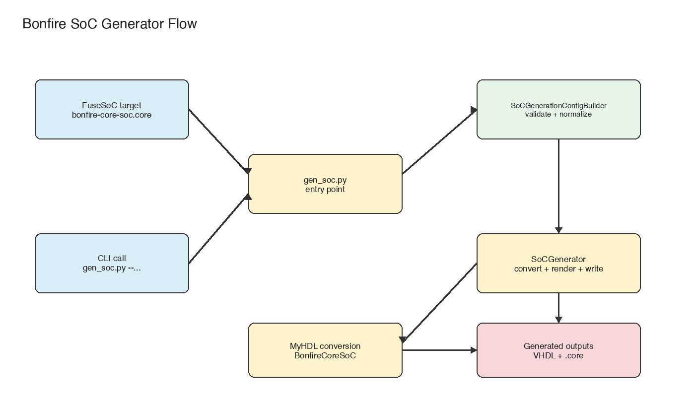
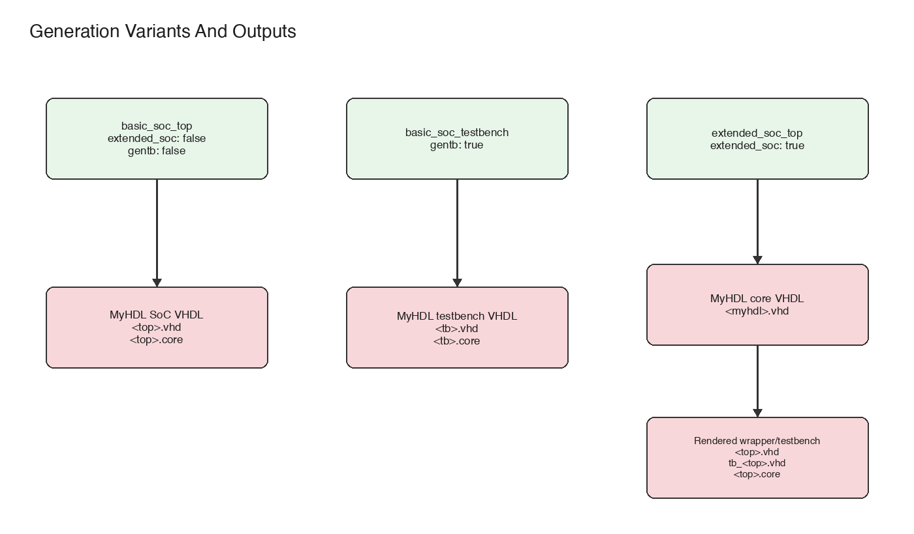
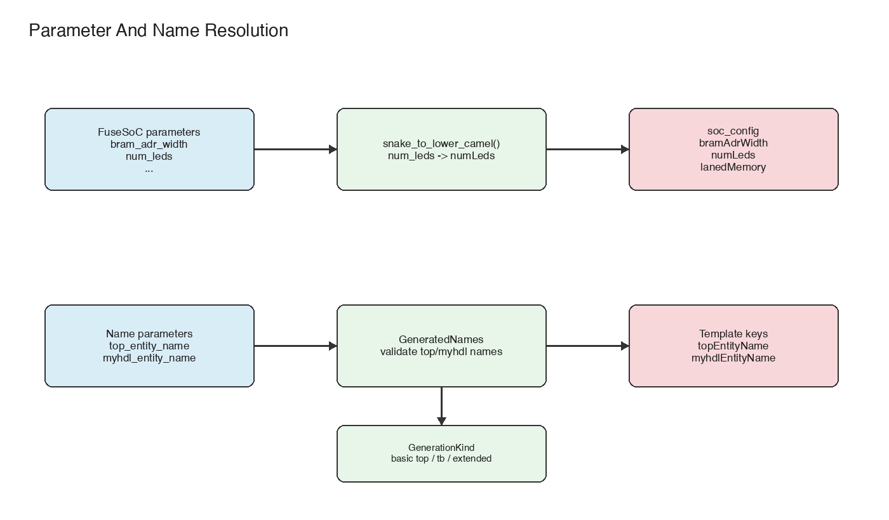

# Bonfire SoC Generator

This document describes the FuseSoC generator flow for `bonfire-core-soc`.
It focuses on the generator implementation under
`fusesoc-cores/generators/` and explains the rules that are not obvious from
the `.core` file alone.



## Entry Points

FuseSoC invokes the generator declared in
`fusesoc-cores/bonfire-core-soc.core`:

```yaml
generators:
  gen_bonfire_core_soc:
    interpreter: python3
    command: generators/gen_soc.py
```

For every selected `generate:` block, FuseSoC writes a generator input YAML file
and calls `gen_soc.py` with that file as the first argument.

The generator input contains:

| Key | Meaning |
| --- | --- |
| `files_root` | Path to the FuseSoC library root, normally `fusesoc-cores` |
| `parameters` | Merged generator parameters from the `.core` file and target overrides |
| `vlnv` | VLNV of the generated temporary core |

Example input YAML passed by FuseSoC:

```yaml
files_root: /path/to/bonfire-core/fusesoc-cores
gapi: "1.0"
parameters:
  language: vhdl
  bram_adr_width: 12
  conversion_warnings: ignore
  top_entity_name: bonfire_core_soc_top
  myhdl_entity_name: bonfire_core_myhdl_top
  hexfile: "../code/build/soc/sim/hello.hex"
  num_leds: 8
  led_active_low: false
  laned_memory: false
  extended_soc: true
vlnv: "::bonfire-core-soc-soc_top:0"
```

`gen_soc.py` also supports a direct CLI mode for development and debugging. If
the first argument starts with `-`, the script treats the invocation as CLI mode
instead of FuseSoC generator mode.

Do not run FuseSoC with `--cores-root .` from this repository. Running FuseSoC
from the repository root should use `fusesoc.conf`, which points FuseSoC to the
`fusesoc-cores` library.

## Minimal Core File Example

A minimal CAPI2 core that instantiates the SoC generator needs three pieces:

- a generator declaration,
- a `generate:` entry that passes the generator parameters,
- a target that references the generated core.

Example:

```yaml
CAPI=2:
name: ::minimal-bonfire-soc:0

generators:
  gen_bonfire_core_soc:
    interpreter: python3
    command: generators/gen_soc.py

generate:
  soc_top:
    generator: gen_bonfire_core_soc
    parameters:
      language: vhdl
      bram_adr_width: 11
      conversion_warnings: ignore
      top_entity_name: bonfire_core_soc_top
      hexfile: "../code/build/soc/sim/led.hex"

targets:
  default:
    generate:
    - soc_top
    toplevel: bonfire_core_soc_top
```

For an extended SoC wrapper, the same minimal structure can be used with
additional parameters:

```yaml
generate:
  soc_top:
    generator: gen_bonfire_core_soc
    parameters:
      language: vhdl
      bram_adr_width: 12
      conversion_warnings: ignore
      top_entity_name: bonfire_core_soc_top
      myhdl_entity_name: bonfire_core_myhdl_top
      hexfile: "../code/build/soc/sim/hello.hex"
      extended_soc: true
      laned_memory: false
      num_leds: 8
```

## Module Responsibilities

The generator is split into small modules:

| File | Responsibility |
| --- | --- |
| `gen_soc.py` | Entry point. Reads FuseSoC YAML or CLI options and calls `SoCGenerator`. |
| `soc_generator_config.py` | Validates parameters, selects the generation variant, resolves names, builds `soc_config`. |
| `soc_generator.py` | Orchestrates cleanup, MyHDL conversion, optional template rendering, and generated `.core` writing. |
| `vhdl_template_renderer.py` | Renders `soc_top.vhd` and `tb_soc.vhd` from Python `str.format()` templates. |
| `generated_core_writer.py` | Writes the temporary generated CAPI2 `.core` file. |

`gen_core.py` is a separate legacy generator for the core-only conversion path
and is not part of this SoC generator flow.

## Generation Variants

The generator currently supports three variants:

| `GenerationKind` | Selected when | Result |
| --- | --- | --- |
| `basic_soc_top` | default, without `gentb` or `extended_soc` | MyHDL SoC converted directly to the public top-level VHDL entity |
| `basic_soc_testbench` | `gentb: true` and not `extended_soc` | MyHDL SoC testbench converted directly to VHDL |
| `extended_soc_top` | `extended_soc: true` | MyHDL SoC converted as an internal core plus generated VHDL wrapper and optional VHDL testbench |



The important distinction is that only `extended_soc_top` has a wrapper layer.
For non-extended generation, the public top-level entity and the MyHDL-generated
entity are necessarily the same VHDL entity.

## Parameter Normalization

FuseSoC generator parameters use `snake_case`. Internal `soc_config` and VHDL
template keys use `lowerCamelCase`.



`SoCGenerationConfigBuilder` converts the normal SoC parameters with
`snake_to_lower_camel()`:

```text
bram_adr_width        -> bramAdrWidth
laned_memory         -> lanedMemory
num_leds             -> numLeds
led_active_low       -> ledActiveLow
expose_wishbone_master -> exposeWishboneMaster
```

The same convention is used for generated VHDL template names:

```text
top_entity_name      -> topEntityName
myhdl_entity_name    -> myhdlEntityName
```

This avoids hand-written mappings such as `num_leds -> numLeds` in the common
case. Defaults are still explicit, because the generator must know which
parameters belong in `soc_config` and what values to use when a target omits
them.

The generator validates the FuseSoC `parameters` dictionary against an explicit
allow-list before conversion starts. Unknown parameters are treated as errors so
that typos in `.core` files fail early.

## Entity Name Rules

The generator distinguishes two names:

| FuseSoC parameter | Internal key | Meaning |
| --- | --- | --- |
| `top_entity_name` | `topEntityName` | Public top-level entity produced by the generator |
| `myhdl_entity_name` | `myhdlEntityName` | Entity name used for the direct MyHDL conversion |

For `basic_soc_top` and `basic_soc_testbench`, there is no wrapper entity. If
both `top_entity_name` and `myhdl_entity_name` are set, they must therefore be
identical. The generator raises `ValueError` if they differ.

For `extended_soc_top`, the names are intentionally different by default:

```text
top_entity_name   = bonfire_core_soc_top
myhdl_entity_name = bonfire_core_myhdl_top
```

The generated wrapper entity is `top_entity_name`. Inside that wrapper, the
MyHDL-generated component is instantiated as `myhdl_entity_name`.

The legacy parameter `entity_name` is still accepted as an alias for
`top_entity_name`, but new `.core` files should use `top_entity_name`.

## SoC Config Keys

These FuseSoC parameters are converted into `soc_config`:

| FuseSoC parameter | `soc_config` key | Default |
| --- | --- | --- |
| `bram_adr_width` | `bramAdrWidth` | `11` |
| `laned_memory` | `lanedMemory` | `true` |
| `num_leds` | `numLeds` | `4` |
| `led_active_low` | `ledActiveLow` | `true` |
| `expose_wishbone_master` | `exposeWishboneMaster` | `false` |
| `num_gpio` | `numGpio` | `8` |
| `enable_uart1` | `enableUart1` | `false` |
| `enable_spi` | `enableSpi` | `false` |
| `num_spi` | `numSpi` | `1` |
| `enable_gpio` | `enableGpio` | `true` |
| `register_wishbone_dbus` | `registerWishboneDbus` | `false` |
| `debug` | `debug` | `false` |
| `enable_jtag_debug` | `enableJtagDebug` | `false` |
| `enable_debug_ndmreset` | `enableDebugNdmreset` | `false` |
| `inst_uart_only` | `instUartOnly` | `false` |
| `uart_fifo_depth` | `uartFifoDepth` | `6` |

For `extended_soc: true`, `exposeWishboneMaster` is forced to `true` even if
the input parameter is absent or false. The VHDL wrapper needs the MyHDL SoC's
Wishbone master interface to connect external VHDL peripherals.

## Hexfile Resolution

`hexfile` is resolved relative to `files_root`.

For FuseSoC generator mode, `files_root` is supplied by FuseSoC and normally
points to `fusesoc-cores`. That is why `.core` files use paths such as:

```yaml
hexfile: "../code/build/soc/sim/hello.hex"
```

The generator checks that the resolved file exists before conversion starts. A
missing firmware image is reported as a generator error.

## Output Files

Before generating new outputs, `SoCGenerator` removes files in the generator
cache that can be produced by the current configuration:

```text
pck_myhdl_011.vhd
<myhdl_entity_name>.vhd
<myhdl_entity_name>.v
<top_entity_name>.core
```

For extended generation it also removes:

```text
<top_entity_name>.vhd
tb_<top_entity_name>.vhd
```

The generated file list is then written into a temporary CAPI2 `.core` file.
FuseSoC consumes that generated core as a dependency of the selected target.

For a basic SoC top-level, the generated core file looks like this:

```yaml
CAPI=2:
name: ::bonfire-core-soc-soc_top:0

filesets:
    rtl:
        file_type: vhdlSource-2008
        files: [ pck_myhdl_011.vhd,bonfire_core_soc_top.vhd ]

targets:
    default:
        filesets:
        - rtl
        - "simulation_target ? (tb)"
```

For an extended SoC, the generated wrapper is added to the RTL fileset and the
generated VHDL testbench is added as a conditional simulation fileset:

```yaml
CAPI=2:
name: ::bonfire-core-soc-soc_top:0

filesets:
    rtl:
        file_type: vhdlSource-2008
        files: [ pck_myhdl_011.vhd,bonfire_core_myhdl_top.vhd,bonfire_core_soc_top.vhd ]

    tb:
        file_type: vhdlSource-2008
        files: [ tb_bonfire_core_soc_top.vhd ]

targets:
    default:
        filesets:
        - rtl
        - "simulation_target ? (tb)"
```

## Template Rendering

Extended generation renders two VHDL templates:

| Template | Output |
| --- | --- |
| `fusesoc-cores/templates/soc_top.vhd` | `<top_entity_name>.vhd` |
| `fusesoc-cores/templates/tb_soc.vhd` | `tb_<top_entity_name>.vhd` |

Template placeholders use the same lowerCamelCase keys as `soc_config`, for
example:

```text
{topEntityName}
{myhdlEntityName}
{numLeds}
{enableSpi}
{numSpi}
```

Boolean template values are rendered as VHDL booleans, i.e. `true` or `false`.

## Practical Debugging

Useful checks while changing the generator:

```sh
python -m py_compile \
  fusesoc-cores/generators/gen_soc.py \
  fusesoc-cores/generators/soc_generator.py \
  fusesoc-cores/generators/soc_generator_config.py \
  fusesoc-cores/generators/generated_core_writer.py \
  fusesoc-cores/generators/vhdl_template_renderer.py
```

```sh
python -m pytest tests/test_bonfire_core_soc_tb.py
python -m pytest tests/test_vhdl_conversion.py
```

```sh
fusesoc run --target=sim --setup ::bonfire-core-soc:0
fusesoc run --target=sim_extended --setup ::bonfire-core-soc:0
fusesoc run --target=icepizero --setup ::bonfire-core-soc:0
```

For direct CLI testing:

```sh
python fusesoc-cores/generators/gen_soc.py \
  --extended_soc \
  --path /private/tmp/bonfire-gen-soc-cli \
  --hexfile code/build/soc/sim/hello.hex
```

The CLI path is mainly for local debugging. The FuseSoC path is the path that
board and simulation targets use.
